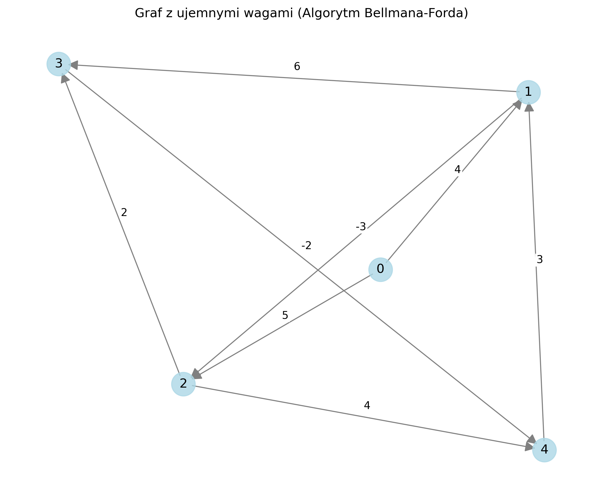

# Shortest Path Algorithms Implementation

This project implements and compares two fundamental shortest path algorithms: Dijkstra's Algorithm and the Bellman-Ford Algorithm. The implementation includes visualization capabilities using NetworkX and Matplotlib.

## Features

- Implementation of Dijkstra's Algorithm for graphs with non-negative weights
- Implementation of Bellman-Ford Algorithm supporting graphs with negative weights
- Graph visualization using NetworkX and Matplotlib
- Example graphs for both algorithms
- Negative cycle detection in Bellman-Ford implementation

## Installation

1. Clone the repository:

```bash
git clone [repository-url]
cd shortest_path
```

2. Install dependencies:

```bash
pip install -r requirements.txt
```

## Usage

Run the main script to see examples of both algorithms in action:

```bash
python main.py
```

This will:

1. Run Dijkstra's algorithm on a simple graph
2. Run Bellman-Ford algorithm on a graph with negative weights
3. Generate visualizations for both graphs

## Project Structure

- `main.py` - Main script with example usage
- `shortest_path.py` - Implementation of both algorithms
- `graph.py` - Graph data structure
- `graph_examples.py` - Example graph configurations
- `visualize.py` - Graph visualization functionality
- `requirements.txt` - Project dependencies

## Algorithm Comparison

### Dijkstra's Algorithm

- Optimized for graphs with non-negative weights
- More efficient than Bellman-Ford
- Cannot handle negative weights

### Bellman-Ford Algorithm

- Can handle graphs with negative weights
- Detects negative cycles
- Generally slower than Dijkstra's algorithm
- More versatile in terms of weight constraints

## Visualization Examples

### Dijkstra's Algorithm Example Graph


### Bellman-Ford Algorithm Example Graph (with negative weights)


