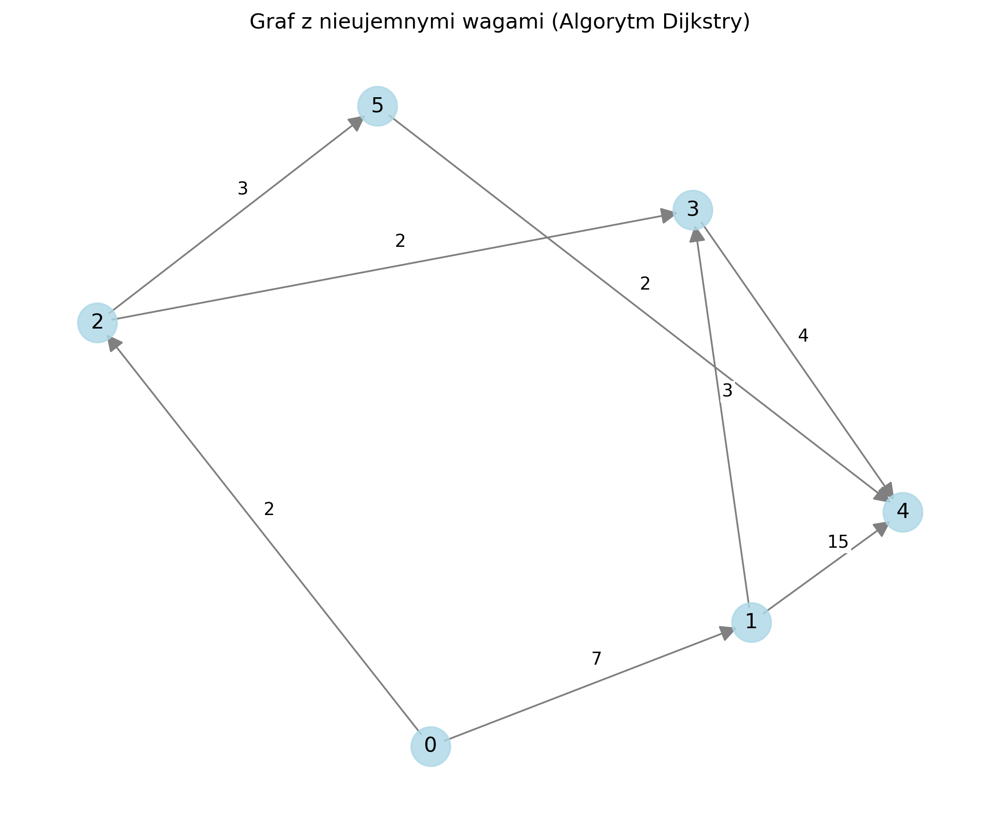

# Opis problemu

Temat: **Problem najkrótszej ścieżki (z jednego miejsca)**

Problem najkrótszej ścieżki z pojedynczego źródła (Single-Source Shortest Path - SSSP) polega na znalezieniu najkrótszych ścieżek z wybranego wierzchołka źródłowego do wszystkich pozostałych wierzchołków w grafie ważonym. Wagi krawędzi reprezentują odległości, koszty, czas lub inne metryki, które chcemy zminimalizować.

Dla grafu ważonego G = (V, E), gdzie:

-   V to zbiór wierzchołków
-   E to zbiór krawędzi
-   Każda krawędź e ∈ E ma przypisaną wagę w(e)

Celem jest znalezienie najkrótszej ścieżki p(s,v) dla każdego wierzchołka v ∈ V, gdzie s jest wierzchołkiem źródłowym. Ścieżka p(s,v) jest sekwencją krawędzi prowadzących od s do v o jak najmniejszej sumie wag.

# Omówienie różnych metod rozwiązania problemu

## Algorytm Dijkstry

Algorytm Dijkstry jest efektywną metodą znajdowania najkrótszych ścieżek w grafach z nieujemnymi wagami krawędzi. Jego główne cechy to:

-   Złożoność czasowa: O((V + E) log V) przy użyciu kolejki priorytetowej
-   Wymóg tego, aby wszystkie wagi były nieujemne
-   Zachłanność
-   Gwarancja znalezienia optymalnego rozwiązania dla grafów z nieujemnymi wagami

Algorytm działa poprzez iteracyjne wybieranie wierzchołka o najmniejszej tymczasowej odległości i relaksację jego krawędzi wychodzących.

## Algorytm Bellmana-Forda

Algorytm Bellmana-Forda jest alternatywną metodą, która działa z ujemnymi wagami krawędzi. Jego główne cechy t:

-   Złożoność czasowa: O(V × E)
-   Obsługa ujemnych wag krawędzi
-   Wykrywanie ujemnych cykli w grafie
-   Mniejsza prędkość, ale większa uniwersalność w porównaniu do algorytmu Dijkstry

Algorytm wykonuje V-1 iteracji relaksacji wszystkich krawędzi, a następnie sprawdza występowanie ujemnych cykli.

# Przykłady zastosowania

Problem najkrótszej ścieżki ma wiele praktycznych zastosowań:

1. Systemy nawigacji GPS

    - Znajdowanie najkrótszej/najszybszej trasy między lokalizacjami
    - Optymalizacja tras w czasie rzeczywistym

2. Sieci komputerowe

    - Routing pakietów w sieciach
    - Optymalizacja opóźnień w komunikacji

3. Logistyka i transport

    - Planowanie tras dostaw
    - Optymalizacja kosztów transportu

4. Media społecznościowe

    - Znajdowanie połączeń między użytkownikami
    - Analiza sieci społecznych

5. Gry komputerowe
    - Pathfinding dla postaci
    - Sztuczna inteligencja NPC

# Opis zastosowanych algorytmów

Implementacja zawiera dwa główne algorytmy:

1. Dijkstra:

```
Algorithm Dijkstra(Graph, start):
    distances ← map of all vertices initialized to infinity
    distances[start] ← 0
    predecessors ← map of all vertices initialized to null
    PriorityQueue queue ← empty priority queue
    queue.insert((0, start))
    visited ← empty set

    while queue is not empty:
        (current_distance, current_vertex) ← queue.removeMin()
        if current_vertex in visited:
            continue
        visited.add(current_vertex)

        for each (neighbor, weight) in Graph.neighbors(current_vertex):
            distance ← current_distance + weight
            if distance < distances[neighbor]:
                distances[neighbor] ← distance
                predecessors[neighbor] ← current_vertex
                queue.insert((distance, neighbor))

    return (distances, predecessors)
```

2. Bellman-Ford:

```
Algorithm BellmanFord(Graph, start):
    distances ← map of all vertices initialized to infinity
    distances[start] ← 0
    predecessors ← map of all vertices initialized to null

    for i from 1 to |V| - 1:
        for each vertex in Graph.vertices:
            for each (neighbor, weight) in Graph.neighbors(vertex):
                if distances[vertex] + weight < distances[neighbor]:
                    distances[neighbor] ← distances[vertex] + weight
                    predecessors[neighbor] ← vertex

    for each vertex in Graph.vertices:
        for each (neighbor, weight) in Graph.neighbors(vertex):
            if distances[vertex] + weight < distances[neighbor]:
                return (distances, predecessors, false)

    return (distances, predecessors, true)
```

# Ilustracja działania programu

Program demonstruje działanie obu algorytmów na dwóch różnych przykładach:

1. Graf z wagami nieujemnymi (Dijkstra):



Wynik dla ścieżki 0 -> 4:

-   Najkrótsza ścieżka: 0 -> 2 -> 5 -> 4
-   Całkowita odległość: 7

2. Graf z wagami ujemnymi (Bellman-Ford):


Wynik dla ścieżki 0 -> 4

-   Najkrótsza ścieżka: 0 -> 1 -> 2 -> 3 -> 4
-   Całkowita odległość: 1

# Podział zadań

-   **Szymon Rafałowski**:

    -   Implementacja algorytmu Dijkstry
    -   Implementacja algorytmu Bellmana-Forda
    -   Implementacja funkcji generującej wizualizacje
    -   Implementacja pseudokodów

-   **Aleks Rogoziński**:

    -   Dokumentacja: opis problemu, opisanie algorytmów, przykłady zastosowania
    -   Implementacja grafu, funkcji main, przykładów grafów
    -   Wsparcie w implementacji algorytmów
    -   Poprawki w funkcji generującej wizualizacje

Link do repozytorium z projektem: https://github.com/szyraf/shortest-path
